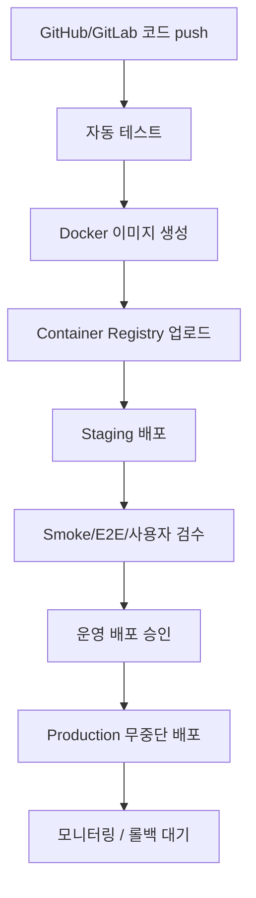

# Deployment Automation Strategy

이 문서는 정비 렌탈 운영 시스템의 배포 자동화 기준입니다. GitHub 또는 GitLab에 코드가 push된 뒤 자동 테스트, Docker 이미지 생성, staging 배포, 승인, production 무중단 배포 순서로 운영합니다.

## 목표 파이프라인



## 단계별 기준

| 단계 | 기준 | 실패 시 처리 |
| --- | --- | --- |
| 코드 push | GitHub 또는 GitLab의 PR/MR, main, release tag를 기준으로 pipeline 실행 | pipeline 중단 |
| 자동 테스트 | typecheck, build, Prisma generate, 필요한 API/단위 테스트 실행 | 이미지 생성 금지 |
| Docker 이미지 생성 | commit SHA와 version tag를 포함한 immutable image 생성 | staging 배포 금지 |
| Staging 배포 | 운영과 유사한 환경에 동일 이미지 배포 | prod 승인 금지 |
| 승인 | 관리자 또는 릴리스 담당자가 변경사항, 테스트 결과, migration 결과 확인 | prod 배포 대기 |
| Production 무중단 배포 | rolling, blue-green, canary 중 하나로 서비스 중단 없이 배포 | 자동 또는 수동 rollback |

## 현재 프로젝트 기준 명령

현재 `package.json` 기준으로 자동 테스트와 빌드는 아래 명령을 우선 사용합니다.

```powershell
npm ci
npm run typecheck
npm run build
```

운영 DB migration은 production 배포 전에 별도 승인 단계에서 실행합니다.

```powershell
npm run prisma:deploy
```

`npm run prisma:migrate`는 개발용 명령이므로 `prod` pipeline에서는 사용하지 않습니다.

## Branch와 환경 매핑

| 소스 | 대상 환경 | 동작 |
| --- | --- | --- |
| feature branch / PR / MR | 임시 검증 | 자동 테스트만 실행 |
| `main` | `staging` | 테스트 통과 후 Docker 이미지 생성 및 staging 자동 배포 |
| release tag 또는 승인된 main commit | `prod` | 수동 승인 후 production 무중단 배포 |
| hotfix branch | `staging` 후 `prod` | 긴급 수정도 staging 검증과 승인 단계를 거침 |

`prod` 배포는 사람이 승인하는 manual gate를 둡니다. 승인자는 변경사항, 테스트 결과, DB migration 영향, rollback 계획을 확인해야 합니다.

## Docker 이미지 원칙

- 이미지는 한 번 빌드한 뒤 staging과 production에 같은 이미지를 승격합니다.
- 이미지에는 `.env`, 운영 DB URL, JWT secret, API key, 인증서 같은 secret을 포함하지 않습니다.
- 이미지 tag에는 최소한 commit SHA를 포함합니다.
- `latest` tag만으로 운영 배포하지 않습니다.
- 이미지 vulnerability scan을 pipeline에 추가합니다.
- Docker build cache를 사용하더라도 최종 이미지는 재현 가능해야 합니다.

권장 tag 예시:

```text
maintenance-system:sha-8aa882c
maintenance-system:2026.06.09-1
```

## 배포 플랫폼 선택 기준

초기에는 운영 부담을 줄이기 위해 Kubernetes보다 Managed Container를 우선 검토합니다. 팀 규모, 장애 대응 인력, 서비스 복잡도, 배포 빈도에 따라 단계적으로 확장합니다.

| 규모 | 추천 방식 | 판단 기준 |
| --- | --- | --- |
| 초기/MVP | Docker + ECS Fargate 또는 NCP 서버 Auto Scaling | 팀이 작고 빠르게 운영 서버를 열어야 하며, 단일 웹/API 중심일 때 |
| 중간 규모 | Kubernetes | 여러 서비스, worker, batch, 복잡한 배포 전략이 필요하고 운영 인력이 있을 때 |
| 대규모/마이크로서비스 | EKS/AKS/GKE/NKS | 다수 마이크로서비스, multi-region, service mesh, 고급 autoscaling이 필요할 때 |
| 팀이 작음 | Kubernetes보다 Managed Container 우선 | 클러스터 운영보다 제품 기능과 안정성에 집중해야 할 때 |

현재 정비 렌탈 운영 시스템은 Next.js 웹/API, batch, DB, object storage 중심 구조이므로 초기 운영은 Docker 이미지 기반 Managed Container 배포를 우선 추천합니다. Kubernetes는 서비스가 여러 개로 분리되고 전담 운영 역량이 생긴 뒤 검토합니다.

추천 우선순위:

1. 초기 운영: Docker image + Managed Container 또는 서버 Auto Scaling
2. 안정화 후: staging/prod blue-green 또는 rolling deployment 자동화
3. 서비스 분리 후: worker/batch/API 분리와 container orchestration 검토
4. 대규모 전환: EKS/AKS/GKE/NKS 같은 managed Kubernetes 검토

## Staging 배포

Staging은 production 전 마지막 검수 환경입니다.

필수 검증:

- 앱 부팅과 로그인 확인
- 주요 API health check
- Prisma migration rehearsal
- 정비 접수, 배정, 완료보고, 승인 흐름 확인
- 엑셀/PDF export 확인
- 파일 업로드와 Object Storage 연결 확인
- branch 권한 필터 확인
- 모바일 앱 staging API 연결 확인
- WAF/rate limit/MFA/감사 로그 기본 동작 확인

Staging 데이터는 운영 원본을 그대로 복사하지 않습니다. 운영 유사 데이터가 필요하면 익명화 후 사용합니다.

## Production 무중단 배포

Production 배포는 무중단 또는 최소 중단을 목표로 합니다.

권장 방식:

| 방식 | 추천 상황 |
| --- | --- |
| Rolling deployment | 일반적인 웹/API 배포 |
| Blue-Green deployment | 빠른 rollback이 중요한 배포 |
| Canary deployment | 일부 사용자 또는 일부 사업장부터 점진 배포 |

무중단 배포 기준:

- 새 컨테이너가 health check를 통과하기 전 기존 컨테이너를 내리지 않습니다.
- DB migration은 backward compatible하게 설계합니다.
- 컬럼 삭제, enum 변경, 대량 backfill은 별도 단계로 분리합니다.
- 배포 중 세션 쿠키와 JWT secret이 갑자기 바뀌지 않게 합니다.
- 파일 업로드 경로와 Object Storage bucket은 배포 중에도 동일하게 유지합니다.

## DB Migration 배포 규칙

DB migration은 무중단 배포의 가장 위험한 부분이므로 별도 규칙을 둡니다.

안전한 순서:

1. 새 컬럼/테이블을 nullable 또는 backward compatible하게 추가
2. 새 앱 버전 배포
3. background job 또는 batch로 backfill
4. 검증 후 필수값, 인덱스, 제약 조건 강화
5. 더 이상 쓰지 않는 컬럼은 다음 릴리스에서 제거

`branch_id` 같은 핵심 컬럼은 한 번에 필수값으로 넣지 않고, `Branch`, `UserBranch`, nullable `branchId`, backfill, 권한 필터, 필수값 전환 순서로 진행합니다.

## 승인 체크리스트

Production 승인 전 확인 항목:

- 자동 테스트 통과
- Docker 이미지 tag와 commit SHA 확인
- staging 배포 및 smoke test 통과
- DB migration 영향 확인
- rollback 계획 확인
- 환경 변수/secret 변경 여부 확인
- 사용자 공지 필요 여부 확인
- 보안 변경, 권한 변경, branch scope 변경 여부 확인

## Rollback 기준

Rollback은 배포 전 항상 준비합니다.

- 앱 컨테이너는 이전 이미지 tag로 즉시 되돌릴 수 있어야 합니다.
- DB migration이 irreversible하면 production 승인 전에 별도 위험 승인을 받습니다.
- migration rollback보다 forward fix가 안전한 경우를 구분합니다.
- 배포 후 오류율, 응답 시간, 로그인 실패율, DB 오류, 파일 업로드 실패율을 즉시 모니터링합니다.

## 감사 로그와 배포 로그

배포 행위도 운영 감사 대상입니다.

기록할 항목:

```text
deployment_id
repository
commit_sha
image_tag
environment
approved_by
deployed_by
started_at
completed_at
result
rollback_of
```

## 현재 적용 범위

이번 문서는 배포 자동화 설계 기준을 고정하기 위한 문서입니다. 현재 변경에서는 실제 GitHub Actions, GitLab CI, Kubernetes, ECS, Docker Compose 운영 스크립트, 인프라 코드는 수정하지 않습니다. 다음 구현 단계에서 선택한 CI/CD 플랫폼에 맞춰 pipeline 파일과 배포 스크립트를 별도 작업으로 추가합니다.
