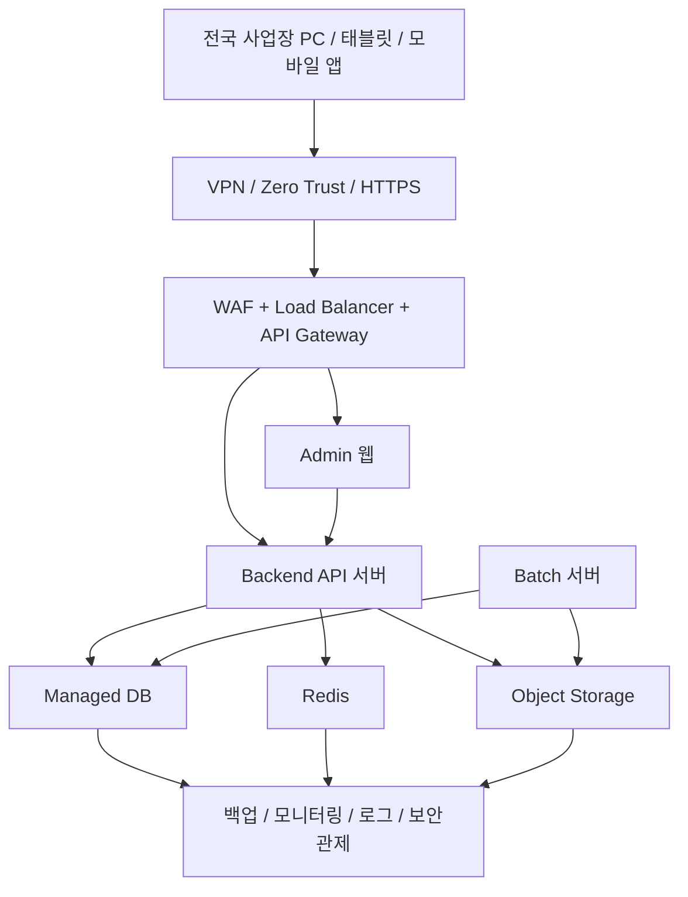

# Korea Central Cloud Architecture

이 문서는 정비 렌탈 운영 시스템의 운영 인프라 기준을 정리합니다. 핵심 방향은 한국 리전 중앙 클라우드 서버 1곳에 서비스를 두고, 전국 사업장이 PC, 태블릿, 모바일 앱으로 접속하며, 사업장별 권한과 데이터를 `branch_id` 기준으로 분리하는 것입니다.

## 목표 구조



## 운영 원칙

1. 서비스의 기준 위치는 한국 리전 중앙 클라우드 1곳입니다.
2. 전국 사업장은 로컬 서버를 원장으로 두지 않고 중앙 API에 접속합니다.
3. 모든 업무 데이터 조회, 등록, 수정, 승인은 중앙 API를 통해 처리합니다.
4. 사업장별 데이터 분리는 `branch_id`를 기준으로 서버에서 강제합니다.
5. 프론트엔드의 사업장 선택값은 편의 필터일 뿐이며, 권한 판단의 최종 기준은 서버 세션과 권한 테이블입니다.
6. 현장 네트워크 장애에 대비한 임시 저장 기능을 만들더라도, 최종 원장은 중앙 DB입니다.

## 사업장 데이터 분리

아래 논리 테이블은 반드시 `branch_id`를 포함하는 방향으로 확장합니다.

| 데이터 영역 | 기준 컬럼 | 설명 |
| --- | --- | --- |
| 주문/접수 | `orders.branch_id` | 사업장별 주문, 접수, 렌탈 요청 구분 |
| 재고/부품 | `inventory.branch_id` | 사업장별 보유 재고와 위치 구분 |
| 직원/정비사 | `employees.branch_id` | 직원의 주 사업장 또는 기본 소속 구분 |
| 정비건 | `work_orders.branch_id` | 정비 접수, 배정, 완료, 승인 데이터 구분 |
| 장비/자산 | `devices.branch_id` | 지게차, 장비, 모바일 단말, 현장 자산 구분 |

`tenant_id`는 회사 또는 테넌트 경계이고, `branch_id`는 같은 회사 안의 사업장 경계입니다. 두 값은 함께 사용할 수 있으며 서로 대체하지 않습니다.

## 권한 모델

사용자는 역할과 허용 사업장을 함께 가져야 합니다.

| 역할 | 사업장 접근 기준 |
| --- | --- |
| `SUPER_ADMIN` | 전체 사업장 관리 가능 |
| `ADMIN` | 배정된 사업장만 관리, 승인, 보고 가능 |
| `EXECUTIVE` | 허용된 사업장의 KPI, 보고, 장비 리스크 조회 가능 |
| `MECHANIC` | 본인 사업장 또는 본인 배정 정비건만 조회/처리 가능 |
| `RECEPTIONIST` | 접수 권한이 있는 사업장만 접수/조회 가능 |

API 구현 기준:

```ts
const allowedBranchIds = await getAllowedBranchIds(session.userId);

const where = {
  branchId: { in: allowedBranchIds },
  deletedAt: null
};
```

## 보안 기준

- 모든 외부 접속은 HTTPS를 기본으로 합니다.
- 사내망 또는 주요 관리자 접속은 VPN 또는 Zero Trust 접근 정책을 적용합니다.
- WAF에서 기본적인 공격 트래픽을 차단합니다.
- API Gateway에서 인증, rate limit, 감사 로그 기준을 통일합니다.
- 관리자, 임원, 최고관리자 권한은 MFA 적용을 우선 검토합니다.
- 파일 업로드는 Object Storage에 저장하고 DB에는 메타데이터와 접근 권한만 저장합니다.

Object Storage 경로 예시:

```text
{tenant_id}/{branch_id}/work-orders/{work_order_id}/{file_name}
```

## 운영/장애 대응

중앙 서버 구조에서는 현장별 로컬 서버 운영 부담이 줄어드는 대신, 중앙 클라우드의 가용성과 모니터링이 중요합니다.

- DB는 Managed DB를 사용하고 자동 백업과 point-in-time recovery를 켭니다.
- Redis는 세션, 캐시, 잠금, 큐 보조 용도로만 사용하며 원장 데이터로 쓰지 않습니다.
- Batch 서버는 보고서 생성, 엑셀 export, 알림 발송, 장비 이상징후 분석을 담당합니다.
- 로그는 API 요청, 권한 거부, 승인/반려, 파일 다운로드, AI 조회를 추적할 수 있어야 합니다.
- 장애 알림은 API 오류율, DB 연결 실패, 배치 실패, 저장소 업로드 실패를 기준으로 설정합니다.

## 배포 환경

운영 서버는 `dev`, `staging`, `prod` 3단계로 분리합니다. 세 환경은 같은 한국 리전 중앙 클라우드 안에 둘 수 있지만, DB, Redis, Object Storage, 환경 변수, 시크릿, 도메인은 서로 섞이지 않게 분리합니다.

| 환경 | 목적 | 데이터 기준 | 배포 기준 |
| --- | --- | --- | --- |
| `dev` | 개발자 기능 개발과 실험 | 샘플 데이터 또는 초기화 가능한 개발 데이터만 사용 | 기능 브랜치 또는 개발 브랜치에서 자동/수동 배포 |
| `staging` | 테스트, 검수, 사용자 승인 테스트 | 운영과 유사한 익명화 데이터 또는 검수용 데이터 사용 | 운영 배포 전 최종 검증, 마이그레이션 리허설 |
| `prod` | 실제 운영 | 실제 고객, 장비, 정비, 승인, 파일 데이터 사용 | 승인된 릴리스만 수동 승인 후 배포 |

환경별 분리 원칙:

- `dev`에서 생성한 데이터는 `staging` 또는 `prod`로 승격하지 않습니다.
- `prod` 데이터는 원본 그대로 `dev`로 복사하지 않습니다. 필요한 경우 익명화 후 `staging` 검수용으로만 사용합니다.
- `DATABASE_URL`, `REDIS_URL`, `JWT_SECRET`, Object Storage bucket, OpenAI/API key는 환경별로 별도 발급합니다.
- 파일 저장소는 환경별 bucket을 분리하는 방식을 우선합니다. prefix만으로 분리하는 방식은 실수 위험이 있으므로 보조 수단으로만 사용합니다.
- 배포 파이프라인은 `dev -> staging -> prod` 순서를 따릅니다.
- DB 마이그레이션은 `dev`에서 1차 검증, `staging`에서 운영 유사 데이터 리허설, `prod`에서 백업 확인 후 적용합니다.
- `prod`에서는 디버그 로그, 테스트 계정의 과도한 권한, 임시 seed 데이터를 사용하지 않습니다.

권장 도메인 예시:

```text
dev-maintenance.example.co.kr
staging-maintenance.example.co.kr
maintenance.example.co.kr
```

권장 Object Storage 분리 예시:

```text
maintenance-dev
maintenance-staging
maintenance-prod
```

## 모바일 앱 배포 채널

모바일 앱도 서버 환경과 동일하게 3개 채널로 분리합니다. 각 앱은 지정된 API만 호출해야 하며, 앱 내부에서 사용자가 임의로 운영 API를 바꾸는 구조는 사용하지 않습니다.

| 앱 채널 | 연결 API | 목적 | 배포 대상 |
| --- | --- | --- | --- |
| 개발 앱 | `dev API` | 개발자 기능 개발, 내부 실험, 빠른 수정 확인 | 개발자와 내부 개발 담당자 |
| 테스트 앱 | `staging API` | 현장 담당자 검수, 관리자 승인 흐름 테스트, 릴리스 전 QA | 검수 담당자와 제한된 파일럿 사용자 |
| 출시 앱 | `prod API` | 실제 전국 사업장 운영 | 실제 사용자 |

모바일 분리 원칙:

- 개발 앱은 `dev` 서버만 호출합니다.
- 테스트 앱은 `staging` 서버만 호출합니다.
- 출시 앱은 `prod` 서버만 호출합니다.
- 앱별 API base URL은 빌드 시점 환경 변수 또는 배포 설정으로 고정합니다.
- 앱 이름, 아이콘 배지, bundle id/package name은 환경별로 구분해 설치 실수를 줄입니다.
- push notification, deep link, OAuth redirect, crash report, analytics도 환경별 프로젝트를 분리합니다.
- `prod` 앱에는 테스트 계정 자동 로그인, 더미 데이터, 디버그 메뉴를 넣지 않습니다.

권장 API URL 예시:

```text
https://api-dev-maintenance.example.co.kr
https://api-staging-maintenance.example.co.kr
https://api-maintenance.example.co.kr
```

## 운영 조합 기준

클라우드, 컨테이너, DB, 파일 저장소, 보안, 배포, 모바일 출시의 권장 조합은 [정비 렌탈 운영시스템 권장 운영 조합](./RECOMMENDED_OPERATION_STACK.md)을 기준으로 합니다. 이 문서는 한국 리전 중앙 클라우드와 사업장별 권한/데이터 분리를 설명하고, 권장 운영 조합 문서는 실제 배포 선택 기준을 보완합니다.

## 현재 적용 범위

현재 변경은 아키텍처 기준 문서 추가입니다. 실제 DB 스키마, API 라우트, 인증 로직은 변경하지 않습니다. 다음 구현 단계에서 `Branch`, `UserBranch`, `branchId` 컬럼, 서버 측 권한 필터, 사업장별 테스트를 별도 작업으로 추가합니다.

## 다음 구현 순서

1. `Branch` 사업장 원장 모델 추가
2. `UserBranch` 사용자-사업장 권한 모델 추가
3. `WorkOrder`, `Equipment`에 nullable `branchId` 추가
4. 기존 `Site`, 고객사, 장비 위치 기준으로 `branchId` backfill
5. 목록/상세/KPI/보고서/AI/export API에 서버 측 사업장 필터 적용
6. `orders`, `inventory`, `employees`, `work_orders`, `devices` 통합 계약 확정
7. 한국 리전 배포 환경에서 백업, 로그, 보안관제, 장애 알림 검증
