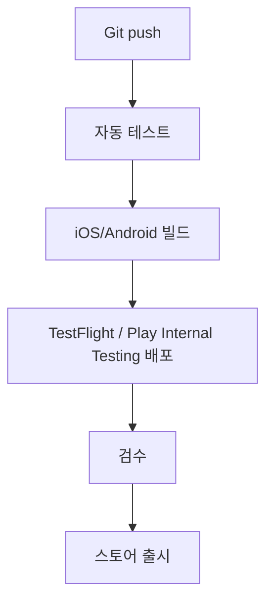

# Mobile Release Automation

정비 렌탈 운영 시스템의 모바일 앱은 Development App, Staging App, Production App으로 분리해서 운영합니다. 각 앱은 서로 다른 API URL, 앱 식별자, 배포 채널을 사용합니다.

## 앱 환경 기준

| 환경 | 앱 | 내부 설정 | API 대상 | 용도 |
| --- | --- | --- | --- | --- |
| `dev` | Development App | `DEV_API_URL` | dev API | 개발자 로컬/개발 서버 검증 |
| `staging` | Staging App | `STAGING_API_URL` | staging API | 본사 테스트, 파일럿 사업장 검수, TestFlight/Play Internal Testing |
| `prod` | Production App | `PROD_API_URL` | prod API | 실제 출시 앱 |

`mobile/app.config.js`가 `APP_ENV`를 읽어 앱 이름, iOS bundle id, Android package, scheme, API URL을 결정합니다.

## 자동화 흐름



현재 저장소에는 GitHub Actions 기준 워크플로를 추가했습니다. GitLab CI, Bitrise, Codemagic으로 옮기더라도 단계와 secret 이름은 동일하게 유지하는 것을 권장합니다.

## GitHub Actions

워크플로 파일: `.github/workflows/mobile-ci.yml`

동작 기준:

- PR: 웹/API typecheck, Next.js build, 모바일 typecheck, Expo health check만 실행합니다.
- `main` push: 검증 후 staging EAS build를 실행합니다. `EXPO_TOKEN`이 없으면 빌드 단계는 건너뜁니다.
- `mobile-v*` tag: 검증 후 production EAS build를 실행합니다. GitHub `production` environment 승인을 거치게 설계했습니다.
- 수동 실행: `workflow_dispatch`에서 `staging` 또는 `production` profile과 submit 여부를 선택합니다.

## EAS Build

파일: `mobile/eas.json`

주요 profile:

- `development`: 내부 개발용 development client
- `staging`: TestFlight / Play Internal Testing 검수용
- `production`: 스토어 출시용
- `preview`: 기존 명령 호환용 staging alias

필수 환경 변수:

```text
APP_ENV=dev|staging|prod
DEV_API_URL=https://api-dev-maintenance.example.co.kr
STAGING_API_URL=https://api-staging-maintenance.example.co.kr
PROD_API_URL=https://api-maintenance.example.co.kr
```

## Fastlane

파일:

- `mobile/fastlane/Appfile`
- `mobile/fastlane/Fastfile`

Lane:

- `fastlane ios beta`: IPA를 TestFlight에 업로드
- `fastlane ios release`: production IPA를 App Store Connect에 업로드
- `fastlane android internal`: AAB를 Play Internal Testing에 업로드
- `fastlane android production`: production AAB를 Play production에 업로드

Fastlane은 EAS Submit을 쓰지 않거나, 별도 빌드 서버에서 생성한 산출물을 직접 스토어로 올릴 때 사용합니다.

## 도구 매핑

| 목적 | 적용 방식 |
| --- | --- |
| 빌드 자동화 | GitHub Actions 기본, 필요 시 GitLab CI / Bitrise / Codemagic으로 동일 단계 이관 가능 |
| 앱 배포 자동화 | EAS Submit 우선, Fastlane 보조 또는 대체 |
| 크래시 분석 | Sentry 또는 Firebase Crashlytics 설정값을 `app.config.js` extra로 주입 |
| 푸시 | Firebase Cloud Messaging + APNs 토큰을 `/api/v1/devices/register`에 저장 |
| 분석 | Firebase Analytics 또는 Amplitude 키를 환경 변수로 주입 |
| 원격 설정 | Firebase Remote Config 또는 자체 설정 API URL을 `REMOTE_CONFIG_URL`로 주입 |

## Secret / 계정 준비

GitHub Variables:

- `DEV_API_URL`
- `STAGING_API_URL`
- `PROD_API_URL`
- `CRASH_REPORTING_PROVIDER`
- `FIREBASE_CRASHLYTICS_ENABLED`
- `ANALYTICS_PROVIDER`
- `REMOTE_CONFIG_PROVIDER`

GitHub Secrets:

- `EXPO_TOKEN`
- `SENTRY_DSN`
- `AMPLITUDE_API_KEY`
- Apple Developer / App Store Connect 인증 정보
- Google Play service account JSON
- Firebase / APNs 발송 자격증명

앱 심사 관련 URL:

- `APP_PRIVACY_POLICY_URL`: 개인정보 처리방침 공개 URL
- `APP_TERMS_URL`: 이용약관 공개 URL
- `APP_SUPPORT_URL`: 앱 지원/문의 URL
- `APP_REVIEW_NOTES_URL`: 심사자 안내 URL
- `APP_SUPPORT_EMAIL`: 고객센터 이메일
- `APP_SUPPORT_PHONE`: 고객센터 전화번호

저장소에 커밋하면 안 되는 항목:

- Apple 인증서, provisioning profile, private key
- Google Play service account JSON
- Firebase service account JSON
- Sentry auth token
- 운영 API key, 관리자 토큰, 장기 refresh token

## 출시 전 확인 필요 사항

- Apple Developer 계정과 bundle id 등록
- Google Play Console 앱 등록과 package name 확정
- TestFlight 내부/외부 테스터 그룹 구성
- Play Internal Testing 테스터 그룹 구성
- FCM/APNs 푸시 자격증명 연결
- Crashlytics 또는 Sentry 실제 프로젝트 연결
- Firebase Analytics 또는 Amplitude 이벤트 수집 동의 문구 검토
- 개인정보 처리방침과 위치/푸시 권한 안내 문구 검토
- dev/staging/prod API CORS, rate limit, 권한 체크 검증
- 심사용 계정, OTP/MFA 안내, 권한 요청 사유, 결제 정책 설명을 `APP_STORE_REVIEW_CHECKLIST.md` 기준으로 검토
- 앱 아이콘과 스크린샷 초안은 `node scripts/generate-mobile-review-assets.mjs`로 생성하고, 정식 제출 전 실제 staging 빌드 캡처로 교체
