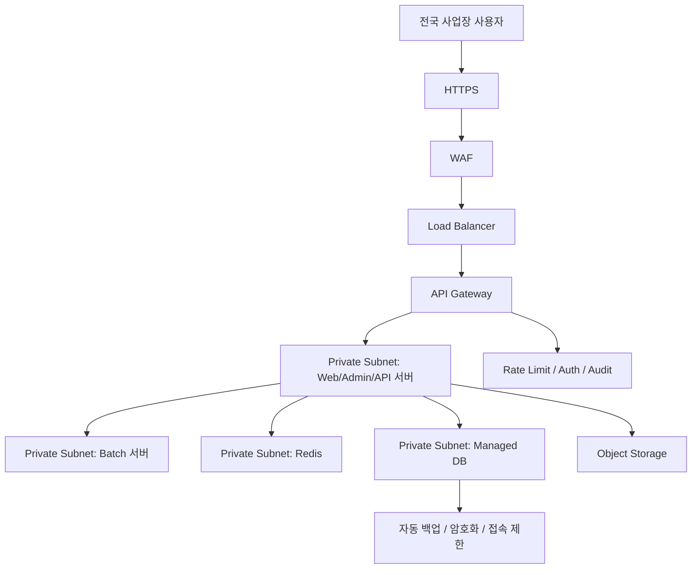

# Network Security Strategy

이 문서는 정비 렌탈 운영 시스템의 네트워크 보안 구성 기준입니다. 한국 리전 중앙 클라우드 1곳에 서비스를 두고, 전국 사업장이 PC, 태블릿, 모바일 앱으로 접속하는 구조를 전제로 합니다.

## 목표 구성



## 필수 보안 요구사항

| 항목 | 기준 | 적용 위치 |
| --- | --- | --- |
| HTTPS 강제 | 모든 외부 접속은 HTTPS만 허용하고 HTTP는 HTTPS로 redirect | Load Balancer, WAF, 앱 설정 |
| WAF 적용 | OWASP Top 10, SQL injection, XSS, 비정상 bot, 악성 요청 차단 | WAF |
| 관리자 페이지 보호 | 관리자 페이지는 IP 제한 또는 MFA를 적용 | WAF, API Gateway, 앱 인증 |
| DB 외부 공개 금지 | DB는 public endpoint를 열지 않고 private network에서만 접근 | Managed DB, VPC/Subnet |
| Private Subnet | Web/Admin/API/Batch/DB/Redis는 private subnet 배치 | Cloud network |
| API Rate Limit | 로그인, AI, export, 파일 업로드, 관리자 API에 요청 제한 적용 | API Gateway, Backend |
| 로그인 실패 제한 | 실패 횟수 기반 계정 잠금, 지연 응답, 감사 로그 저장 | Backend Auth |
| 감사 로그 저장 | 로그인, 권한 변경, 승인/반려, 민감 조회, 파일 다운로드 기록 | Backend, DB, Log pipeline |

## 네트워크 구역

| 구역 | 배치 대상 | 외부 공개 여부 |
| --- | --- | --- |
| Public Subnet | Load Balancer, WAF endpoint, NAT Gateway | 제한적 공개 |
| Private App Subnet | Web/Admin/API 서버 | 외부 직접 공개 금지 |
| Private Worker Subnet | Batch 서버, queue worker | 외부 직접 공개 금지 |
| Private Data Subnet | Managed DB, Redis | 외부 공개 금지 |
| Object Storage | 첨부파일, 보고서 export, 백업 산출물 | signed URL 또는 서버 프록시로 제한 |

운영 원칙:

- 사용자는 Load Balancer 또는 WAF endpoint로만 접속합니다.
- API 서버와 Admin 웹은 public IP를 가지지 않습니다.
- DB, Redis는 public endpoint를 비활성화합니다.
- 운영자 DB 접속은 VPN, Zero Trust, bastion 중 승인된 경로로만 허용합니다.
- outbound 인터넷 접근은 NAT Gateway 또는 egress firewall로 통제합니다.

## HTTPS 강제

운영 환경에서는 HTTPS를 기본값이 아니라 필수 조건으로 둡니다.

- TLS 인증서는 자동 갱신 가능한 관리형 인증서를 사용합니다.
- HTTP 요청은 HTTPS로 redirect하거나 차단합니다.
- HSTS 적용을 검토합니다.
- 쿠키는 `Secure`, `HttpOnly`, `SameSite` 정책을 적용합니다.
- `prod`에서는 개발용 self-signed 인증서를 사용하지 않습니다.

## WAF 정책

WAF는 운영 트래픽의 1차 방어선입니다.

우선 적용 룰:

- OWASP managed rule
- SQL injection 차단
- XSS 차단
- path traversal 차단
- 비정상 user-agent 또는 bot 제한
- 파일 업로드 endpoint 크기 제한
- 국가/지역 기반 제한이 필요한 관리자 endpoint 보호

WAF는 정상 업무를 막을 수 있으므로 `staging`에서 먼저 로그 모드로 검증한 뒤 `prod` 차단 모드로 전환합니다.

## 관리자 페이지 보호

관리자 페이지와 관리자 API는 일반 사용자 화면보다 강하게 보호합니다.

권장 기준:

- 본사 최고관리자, 지역 관리자, 사업장 관리자, 임원은 MFA를 적용합니다.
- 관리자 페이지는 가능하면 사무실/VPN/Zero Trust IP 대역만 허용합니다.
- IP 제한이 어려운 모바일 관리자는 MFA와 device trust를 필수로 둡니다.
- 계정/권한, 감사 로그, KPI, 보고서 export, DB 운영 기능은 추가 재인증을 요구할 수 있습니다.
- 관리자 API는 프론트엔드 메뉴 숨김이 아니라 서버에서 role과 branch scope를 다시 검사합니다.

## DB 접속 제한

DB는 외부 인터넷에 공개하지 않습니다.

- DB public access는 비활성화합니다.
- API 서버와 batch 서버의 private subnet/security group에서만 접속을 허용합니다.
- 운영자 직접 접속은 VPN/Zero Trust/bastion을 통과해야 합니다.
- read replica도 동일하게 private network에 둡니다.
- 백업 파일과 snapshot은 암호화하고 접근 권한을 최소화합니다.
- DB 계정은 API 런타임, batch, migration, read-only 용도로 분리합니다.

## API Rate Limit

Rate limit은 사용자 불편을 줄이면서 공격과 오남용을 막는 수준으로 적용합니다.

우선 적용 대상:

| 대상 | 제한 기준 |
| --- | --- |
| 로그인 API | 계정 + IP 기준 실패 횟수 제한 |
| 비밀번호 변경/초기화 | 계정 + IP 기준 짧은 시간 반복 제한 |
| AI API | 사용자 + branch + 시간 단위 quota |
| Excel/PDF export | 사용자 + branch + 시간 단위 제한 |
| 파일 업로드 | 파일 크기, 개수, 시간당 요청 수 제한 |
| 관리자 API | 사용자 + IP + 기능별 제한 |

Rate limit 초과는 감사 로그와 보안 로그에 남깁니다.

## 모바일 앱 API 보안

모바일 앱 API는 HTTPS, 토큰 인증, 기기 식별, 권한 체크를 모두 통과해야 합니다. 어느 하나라도 실패하면 업무 데이터를 반환하지 않습니다.

요청 검증 순서:

```text
모바일 앱 요청
  -> HTTPS 강제
  -> access token 검증
  -> refresh token / 세션 상태 검증
  -> 기기 식별자와 trusted device 상태 검증
  -> 사용자 role 확인
  -> branch_id / 권역 / 협력사 scope 확인
  -> API 기능별 권한 체크
  -> 감사 로그 저장
```

필수 기준:

| 항목 | 기준 |
| --- | --- |
| HTTPS | 모바일 앱은 `dev`, `staging`, `prod` 모두 HTTPS API만 호출 |
| 토큰 인증 | access token은 짧게 유지하고 refresh token은 기기 단위로 관리 |
| 기기 식별 | 앱 설치 또는 최초 로그인 시 기기 식별자를 등록하고 서버에서 신뢰 상태를 확인 |
| 권한 체크 | 모든 API에서 role과 `branch_id` scope를 서버에서 다시 검사 |
| 기기 폐기 | 분실, 퇴사, 협력사 계약 종료 시 해당 기기의 refresh token과 trusted device를 폐기 |
| 재인증 | 완료보고, 승인, 권한 변경, 민감 보고서 다운로드 전 MFA 또는 생체 재인증 검토 |

모바일 토큰 운영 원칙:

- access token은 탈취 피해를 줄이기 위해 만료 시간을 짧게 둡니다.
- refresh token은 서버에 해시로 저장하고, 기기별로 발급/폐기할 수 있어야 합니다.
- refresh token rotation을 적용해 재사용 공격을 탐지합니다.
- 로그아웃, 기기 분실 신고, 계정 비활성화 시 해당 기기의 refresh token을 즉시 폐기합니다.
- 모바일 앱에는 운영 API 키나 관리자 secret을 포함하지 않습니다.

권장 감사 로그:

```text
mobile.login
mobile.token.refresh
mobile.device.register
mobile.device.revoke
mobile.permission.denied
mobile.sensitive_action.reauth
```

## 로그인 실패 제한

현재 코드에는 로그인 실패 횟수 기반 잠금 로직이 있으므로, 운영 설계에서도 이를 유지하고 강화합니다.

권장 기준:

- 연속 실패 횟수 초과 시 일정 시간 계정을 잠급니다.
- 같은 IP에서 여러 계정에 반복 실패하면 IP 기반 제한을 적용합니다.
- 관리자 계정 실패는 별도 보안 알림 대상으로 둡니다.
- 계정 잠금/해제는 감사 로그에 남깁니다.
- 비밀번호 대신 SSO/MFA를 사용하는 경우에도 실패 이벤트를 같은 audit pipeline에 기록합니다.

## 감사 로그

감사 로그는 운영 판단과 보안 사고 대응을 위해 반드시 남깁니다.

필수 기록:

- 로그인 성공/실패/잠금/로그아웃
- MFA 성공/실패
- 사용자 생성, 비활성화, 권한 변경
- branch 권한 변경
- 정비건 승인/반려/최종확정
- 계획업무 승인/반려/최종확정
- KPI 조회, 보고서 다운로드, Excel/PDF export
- 파일 업로드/다운로드/삭제
- AI 민감 자료 요청과 권한 차단
- 관리자 설정 변경

로그 필드 기준:

```text
timestamp
actor_user_id
actor_roles
branch_id
source_ip
user_agent
action
target_type
target_id
result
reason
request_id
```

감사 로그는 일반 사용자가 수정하거나 삭제할 수 없어야 하며, 운영 보관 기간과 별도 백업 정책을 둡니다.

## 환경별 적용 기준

| 환경 | 기준 |
| --- | --- |
| `dev` | 보안 기능 개발과 테스트. 외부 공개 금지, 더미 데이터만 사용 |
| `staging` | WAF/rate limit/MFA/감사 로그를 운영 유사 조건으로 검증 |
| `prod` | HTTPS/WAF/MFA/Private Subnet/DB 비공개/rate limit/감사 로그 필수 |

## 현재 적용 범위

이번 문서는 네트워크 보안 설계 기준을 고정하기 위한 문서입니다. 현재 변경에서는 실제 인프라, API Gateway, WAF, Prisma schema, 애플리케이션 코드를 수정하지 않습니다. 다음 구현 단계에서 인프라 코드, rate limit 미들웨어, MFA, 관리자 IP 제한, 감사 로그 보강을 별도 작업으로 추가합니다.
