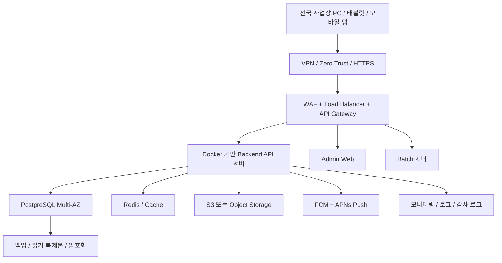
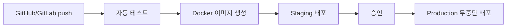

# 정비 렌탈 운영시스템 권장 운영 조합

이 문서는 정비 렌탈 운영시스템의 운영, 배포, 모바일 출시 기준을 정리한 표준 방향입니다. 초기 MVP는 빠르게 운영 검증이 가능한 Managed Container 중심으로 시작하고, 전국 사업장 확장과 트래픽 증가 시 Kubernetes로 단계적으로 전환합니다.

## 권장 조합 요약

| 영역 | 권장 기준 |
| --- | --- |
| 서버 리전 | AWS Seoul 또는 NAVER Cloud Korea |
| Backend | Docker 기반 API 서버 |
| 운영 방식 | Managed Container 우선, 규모 확대 시 Kubernetes |
| DB | PostgreSQL Multi-AZ |
| 파일 | S3 또는 Object Storage |
| 보안 | WAF, VPN/Zero Trust, MFA, 감사 로그 |
| 배포 | GitHub/GitLab, CI/CD, Terraform |
| 모바일 | React Native 우선, 필요 시 Flutter 검토 |
| 푸시 | FCM + APNs |
| 출시 | 직원용은 비공개 배포 우선, 고객용은 App Store + Google Play 공개 출시 |

## 기준 아키텍처



## 클라우드와 서버

운영 리전은 한국 중앙 리전 1곳을 기준으로 잡습니다. AWS Seoul 또는 NAVER Cloud Korea 중 회사의 계약, 네트워크 품질, 보안 정책, 운영 인력 경험을 기준으로 최종 선택합니다.

Backend API 서버는 Docker 이미지를 기준으로 배포합니다. 초기에는 ECS Fargate, NAVER Cloud Managed Container, 또는 이와 유사한 Managed Container 서비스를 우선 검토합니다. 규모가 커지고 서비스가 여러 도메인으로 분리되면 EKS, NKS, AKS, GKE 같은 Kubernetes 계열로 전환합니다.

Admin Web, Web Admin API, Mobile App API, Public Customer API, Internal Admin API는 논리적으로 분리해 설계합니다. 모바일 API는 `/api/v1`, `/api/v2`처럼 버전을 반드시 포함합니다.

## 데이터베이스와 파일

DB는 PostgreSQL Multi-AZ를 기본 기준으로 합니다. 자동 백업, 읽기 복제본, 암호화, 접속 제한, Private Subnet 배치를 전제로 합니다.

모든 주요 업무 테이블에는 사업장 분리를 위해 `branch_id`를 포함합니다.

```text
orders.branch_id
inventory.branch_id
employees.branch_id
work_orders.branch_id
devices.branch_id
```

관리자는 여러 `branch_id` 접근이 가능하고, 일반 직원은 자기 `branch_id`만 접근합니다. 본사 최고관리자는 전체 사업장 조회와 관리가 가능해야 합니다.

파일은 S3 또는 Object Storage에 저장하고, 공개 URL 대신 권한 검증 후 발급되는 signed URL을 사용합니다. 권장 경로는 환경과 사업장을 함께 포함합니다.

```text
{env}/{branch_id}/{domain}/{yyyy}/{mm}/{file_id}
```

## 보안 기준

운영 보안은 다음 항목을 필수 기준으로 둡니다.

- HTTPS 강제
- WAF 적용
- VPN 또는 Zero Trust 접근
- 관리자 MFA 또는 IP 제한
- DB 외부 공개 금지
- 서버 Private Subnet 배치
- API Rate Limit
- 로그인 실패 제한
- 감사 로그 저장
- 모바일 API 토큰 인증, 기기 식별, 권한 체크

비밀번호 원문, 주민등록번호, 카드번호, 민감정보 평문, 관리자 토큰 장기 저장은 금지합니다. 꼭 저장해야 하는 모바일 정보는 iOS Keychain, Android Keystore, Secure Storage를 사용합니다.

## 배포 자동화

표준 배포 흐름은 아래 순서를 기준으로 합니다.



인프라 설정은 Terraform으로 관리합니다. CI/CD는 GitHub Actions 또는 GitLab CI를 우선 사용하고, 배포 대상은 초기에는 Managed Container를 기준으로 합니다.

## 모바일 기준

현재 프로젝트는 React Native를 우선 기준으로 둡니다. Flutter는 조직 내 경험, 기존 앱 통합 방식, 성능 요구가 React Native와 맞지 않을 때 대안으로 검토합니다.

모바일 앱은 환경별로 분리합니다.

| 앱 | 연결 API |
| --- | --- |
| Development App | dev API |
| Staging App | staging API |
| Production App | prod API |

앱 설정은 다음 환경 변수를 기준으로 합니다.

```text
DEV_API_URL
STAGING_API_URL
PROD_API_URL
```

푸시는 FCM + APNs를 사용합니다. 서버 DB에는 다음 정보를 저장합니다.

```text
user_id
branch_id
device_id
push_token
platform
app_version
last_active_at
```

오프라인 모드는 앱 로컬 DB에 작업을 저장한 뒤 인터넷 복구 시 중앙 서버와 동기화합니다. 중복 처리를 막기 위해 `request_id`, `sync_id`, `created_at`, `device_id`를 서버에서 함께 검증합니다.

## 출시 전략

직원용 앱은 비공개 배포를 우선합니다. iOS는 TestFlight 또는 Apple Business Manager, Android는 Play Internal Testing, Closed Testing, Managed Google Play를 검토합니다.

고객용 앱으로 확장할 경우 App Store와 Google Play 공개 출시를 기준으로 준비합니다. 앱 심사 전에 테스트 계정, 테스트 사업장 데이터, 개인정보 처리방침 URL, 이용약관 URL, 고객센터 연락처, 앱 설명, 스크린샷, 앱 아이콘, 권한 사용 사유를 준비해야 합니다.

## 단계별 적용

1. 본사 내부 테스트: 로그인, 권한, 사업장별 데이터 분리, 보고서, 속도, 오류 로그, 백업, 모바일 API를 검증합니다.
2. 파일럿 사업장 1~3곳: 수도권, 지방 대도시, 인터넷 환경이 약한 지점을 포함해 실제 업무 흐름과 알림 품질을 확인합니다.
3. 권역별 확대: 수도권, 충청권, 영남권, 호남권, 강원/제주 순으로 교육, 계정 발급, 장비 세팅, 장애 대응 창구를 준비합니다.
4. 전국 운영 전환: 전체 사업장 계정, 사업장 코드, 관리자 권한, 개인정보 처리방침, 이용약관, 장애 대응 매뉴얼, 백업 복구 테스트, 모바일 앱 배포, 운영 문의 채널을 최종 점검합니다.

## 정식 런칭 전 확인 필요 항목

직원 정보, 고객 정보, 위치 정보, 결제 정보, 출입 기록, CCTV, 건강 정보가 포함되면 개인정보보호 검토가 필요합니다. 개인정보 처리방침에는 처리 목적, 수집 항목, 보유기간, 제3자 제공, 위탁, 파기, 안전성 확보조치, 개인정보 보호책임자를 포함해야 합니다.

서비스 규모와 업종에 따라 ISMS 또는 ISMS-P 인증 대상 여부도 정식 런칭 전에 검토해야 합니다.
